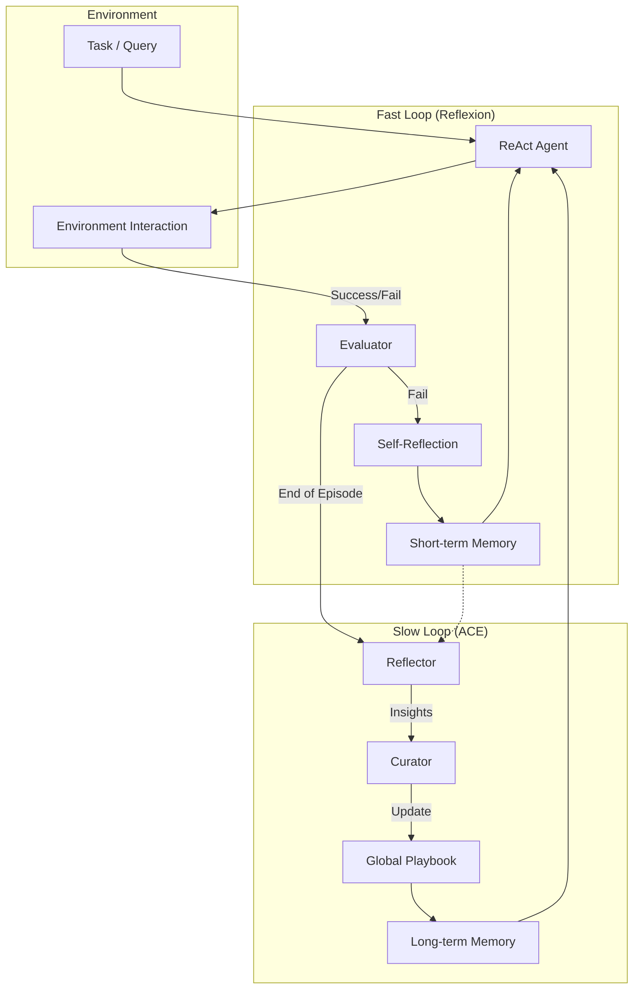

# ReflACE: Dual Looped Self-Refinement Agent

ReflACE is a research project exploring the integration of **Reflexion** (Short-term Self-Correction) and **ACE** (Automatic Computer via Evolution / Long-term Memory) into a unified agentic architecture.

This project implements and benchmarks the **Dual Process Theory** in autonomous agents, combining a "Fast Loop" for immediate error correction with a "Slow Loop" for cross-episodic knowledge accumulation.

## 🌟 Theoretical Background: Dual Memory System

The ReflACE architecture mimics human cognitive processes by maintaining two distinct memory loops:

1.  **Fast Loop (Reflexion)**: Corresponds to **Working/Episodic Memory**.
    *   **Role**: Detects immediate failures and corrects them within the current episode through trial-and-error.
    *   **Mechanism**: Verbal reinforcement learning (Self-reflection).
    *   **Benefit**: High adaptability to novel, transient errors.

2.  **Slow Loop (ACE)**: Corresponds to **Long-term/Semantic Memory**.
    *   **Role**: Consolidates experiences from multiple episodes into a structured "Playbook" of generalizable rules and strategies.
    *   **Mechanism**: Semantic deduplication, abstraction, and curation of successful trajectories.
    *   **Benefit**: Reduced trial-and-error in future tasks, leading to higher efficiency and "Pass@1" rates.

### Architecture Diagram



## 🧪 Experimental Workflows

This repository facilitates an ablation study across four agent configurations:

| Mode | Components | Memory Type | Description |
|------|------------|-------------|-------------|
| **ReAct** | ReAct Only | None (Memory-less) | Baseline reasoning and acting agent. |
| **Reflexion** | ReAct + Reflexion | Short-term (Episodic) | Learns from mistakes within a single episode but resets after completion. |
| **ACE** | ReAct + ACE | Long-term (Semantic) | Uses a pre-learned Playbook but lacks immediate error-correction. |
| **ReflACE** | ReAct + Reflexion + ACE | Dual (Episodic + Semantic) | **The proposed architecture.** Combines fast adaptation with long-term evolution. |

## 🚀 Getting Started

### Prerequisites

- Python 3.10+
- OpenAI API Key (or compatible LLM endpoint)

### Installation

1. Clone the repository:
   ```bash
   git clone https://github.com/MartinusChoi/ReflACE.git
   cd ReflACE
   ```

2. Create and activate a conda environment (optional but recommended):
   ```bash
   conda create -n reflace python=3.10
   conda activate reflace
   ```

3. Install dependencies:
   ```bash
   pip install -r requirements.txt
   ```

4. Set up environment variables:
   ```bash
   export OPENAI_API_KEY="your-api-key"
   ```

### Usage

Run the main entry point with the desired agent mode:

```bash
# Run the Baseline ReAct Agent
python main.py --mode react

# Run with Reflexion (Fast Loop)
python main.py --mode reflexion

# Run with ACE (Slow Loop)
python main.py --mode ace

# Run the Full ReflACE Architecture
python main.py --mode reflace
```

## 📂 Project Structure

```
ReflACE/
├── config/             # Configuration files
├── data/               # Dataset (ALFWorld, etc.)
├── experiments/        # Experiment logs and results
├── src/
│   ├── agent/          # Agent implementations (react, reflexion, ace)
│   ├── core/           # Core ACE components (reflector, curator, playbook)
│   ├── env/            # Environment wrappers (alfworld, etc.)
│   └── llm/            # LLM Client wrappers
├── .context/           # Project documentation and guidelines
├── main.py             # Entry point
└── requirements.txt    # Python dependencies
```

## 📚 References

This project builds upon the following foundational research:

- **ReAct**: [Yao et al. (2022)](https://arxiv.org/abs/2210.03629) - *Reasoning and Acting*
- **Reflexion**: [Shinn et al. (2023)](https://arxiv.org/abs/2303.11366) - *Language Agents with Verbal Reinforcement Learning*
- **ACE**: [Zhang et al. (2025)](https://arxiv.org/abs/2402.13506) - *Automatic Computer via Evolution*
